

  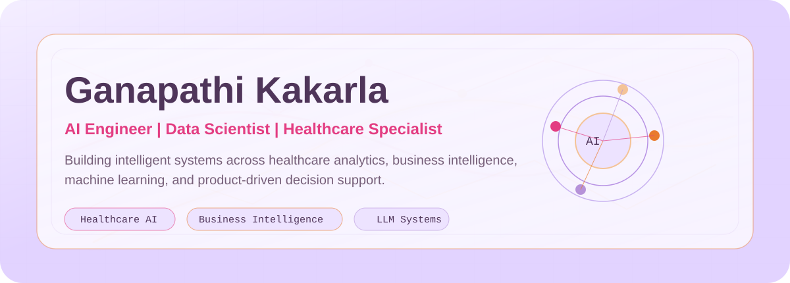

  

  
  
  

## System Profile

  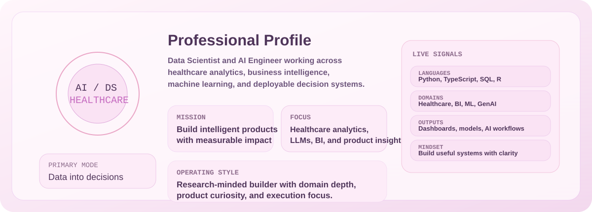

Currently pursuing a **PGDM in AI and Data Science (Healthcare)** at **IIHMR Bangalore** after a **B.Sc in Cardiac Care and Cardiovascular Technology**, I build systems at the intersection of healthcare analytics, business intelligence, machine learning, and product thinking. My work is centered on turning complex data into clear decisions, usable tools, and measurable outcomes.

## Timeline

  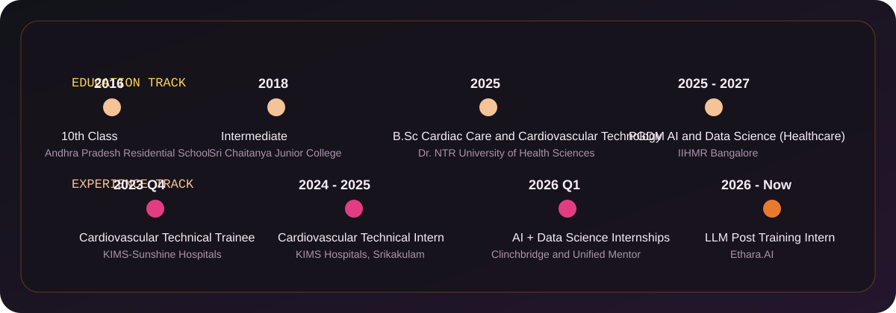

## Capability Matrix

  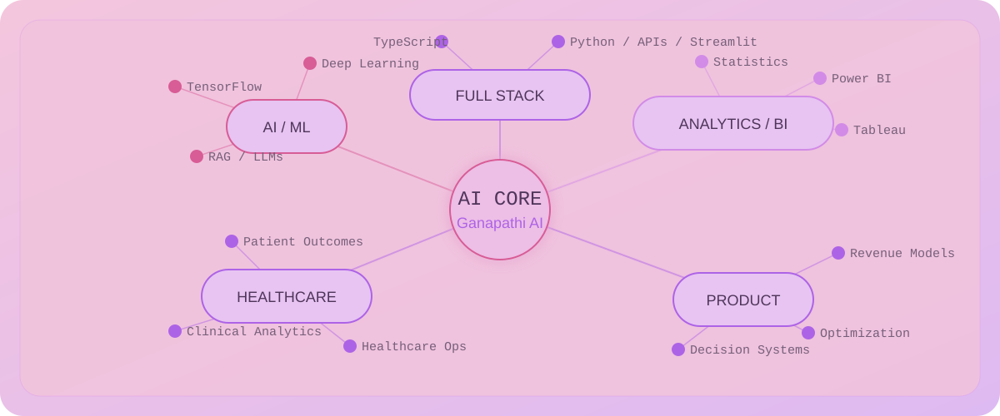

  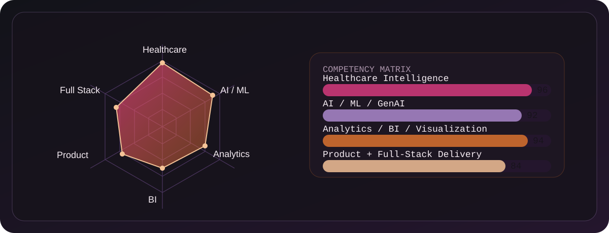

  Python | TypeScript | SQL | R | TensorFlow | Scikit-Learn | Power BI | Tableau | Streamlit | Docker | PostgreSQL | MongoDB

## Certification Grid

  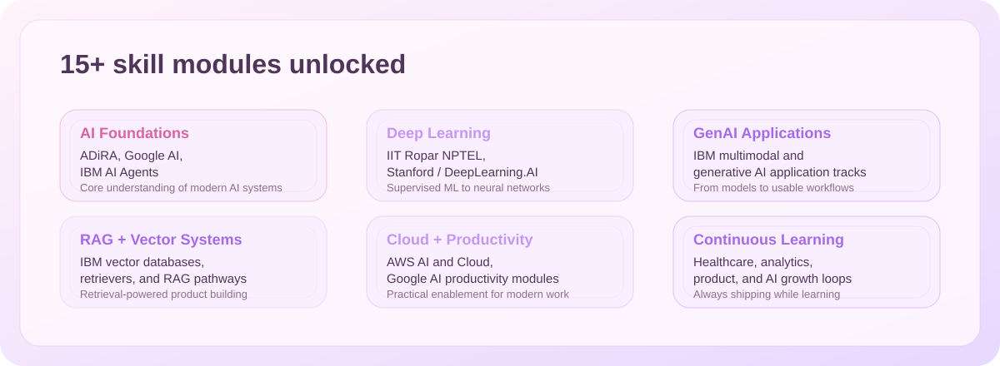

  IIT Ropar NPTEL | DeepLearning.AI / Stanford | IBM | Google | AWS | ADiRA

## Project Modules

  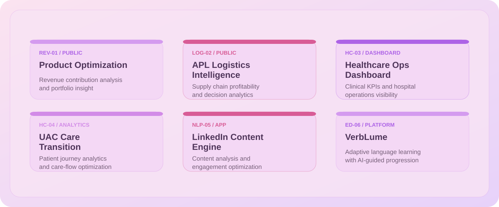

| Module | What it does |
| --- | --- |
| [Product Optimization](https://github.com/ganapathi-ai/Product_Optimization_-_Revenue_Contribution_Analysis) | Revenue contribution analysis and product portfolio insight generation |
| [APL Logistics Intelligence](https://github.com/ganapathi-ai/APL_Logistics_Profitability_Intelligence-) | Supply chain profitability analytics and decision support |
| [Healthcare Ops Dashboard](https://github.com/ganapathi-ai/Healthcare-Operations-Dashboard--POWER-BI) | Power BI dashboard for clinical KPIs and hospital operations visibility |
| [UAC Care Transition](https://github.com/ganapathi-ai/uac-care-transition-analytics) | Patient journey analytics and care-flow optimization |
| [LinkedIn Content Engine](https://github.com/ganapathi-ai/LinkedIn-Content-Engine-) | Content intelligence system for engagement-oriented optimization |
| [VerbLume](https://github.com/ganapathi-ai/VerbLume) | Adaptive language learning platform with AI-guided progression |

## Achievement Path

  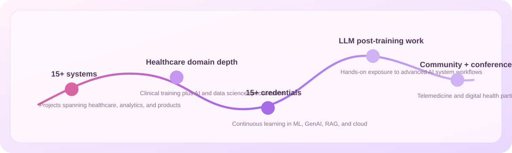

## Command Center

  

<table>
  <tr>
    <td width="50%">
      
    </td>
    <td width="50%">
      
    </td>
  </tr>
  <tr>
    <td colspan="2">
      
    </td>
  </tr>
</table>

## Snake Ecosystem

  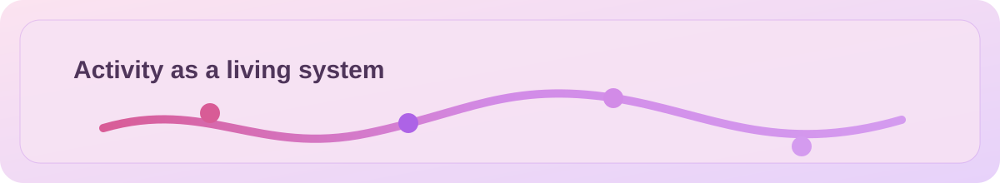

  

## Orbit Contact

  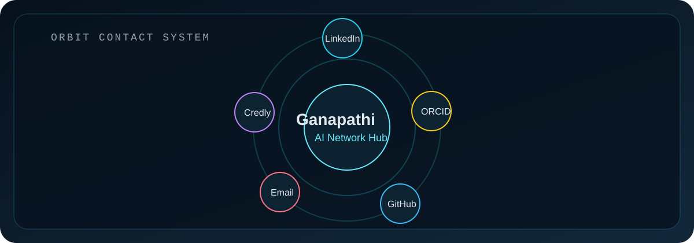

  
  
  
  
  

  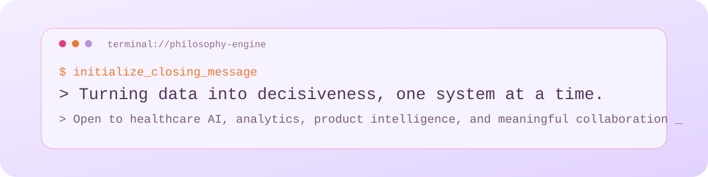

